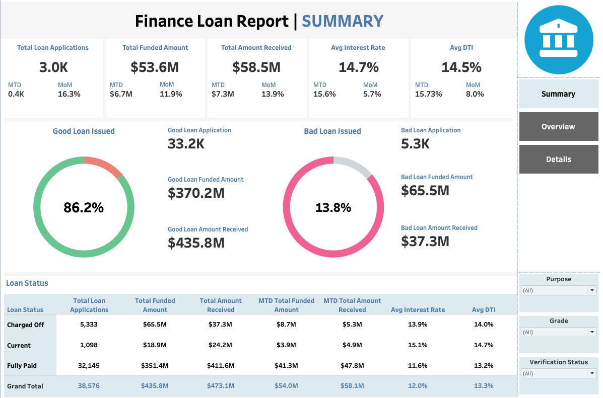
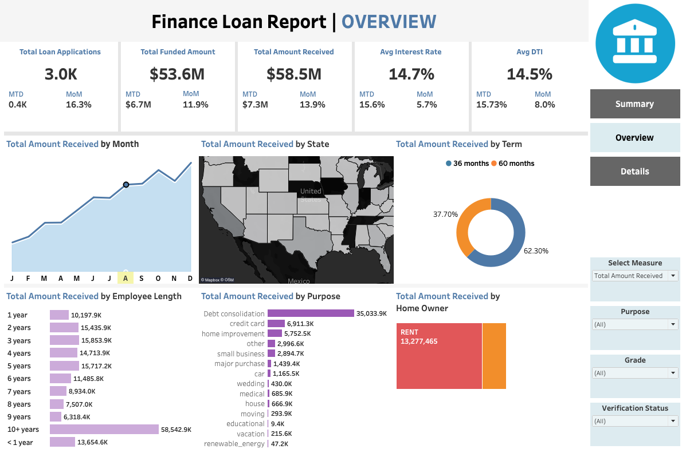
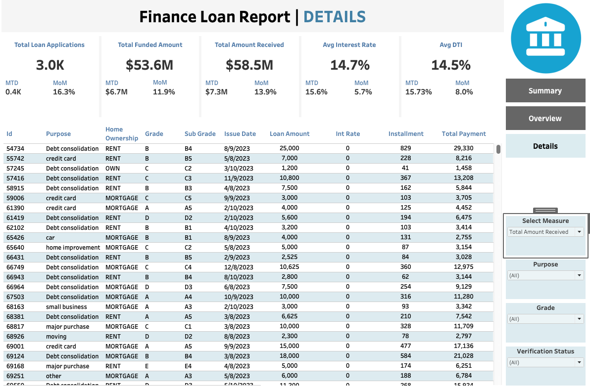

# Finace Loan Report

A data analysis project that evaluates loan disbursement trends, risk segmentation, and repayment performance using SQL and Tableau. 

---

## 🎯 Business Objective

To assess loan performance and identify credit risk segments, enabling management to optimize strategy, reduce bad loan ratios, and improve lending decisions.

---

## 📊 Key Metrics & KPIs

- Total Loan Applications
- Funded Amount (Total, MTD, PMTD)
- Amount Received from Borrowers
- Average Interest Rate
- Average Debt-to-Income (DTI)
- Good vs Bad Loan Ratios
- Performance by Term, Purpose, Region, and Grade

---

## 📈 Insights & Recommendations

### 🔹 Good Loan vs Bad Loan Summary
**Good Loans**  
- 86.18% | 33.2K Applications | $370.2M Funded | $435.8M Received  

**Bad Loans**  
- 13.82% | 2.5K Applications | $65.5M Funded | $37.3M Received  

### 🔹 Additional Findings
- **Dec** had the highest number of applications (~4.3k)
- **36-month terms** were most common (28.2K loans)
- **10+ year employees** received highest funded amounts
- **Debt Consolidation** was the top loan purpose

### 🔹 Business Recommendations
- Tighten lending for **renters** with <2 years employment (higher default)
- Re-evaluate interest rates for **60-month loans** (lower repayment rate)
- Monitor repayment behavior for **debt consolidation** loans

---

## 📊 Tableau Dashboard Pages
[🔗 View Full Tableau Dashboard on Tableau Public](https://public.tableau.com/views/LoanDashboard_YourName/ExecutiveSummary)

1. **Executive Summary**: KPIs, MoM Growth, Good vs Bad Loan Ratio

3. **Loan Overview**: Monthly trends, Purpose, Region, Term, Employment

4. **Loan Details**: Interactive slicers by Grade, Status, Purpose

---

## 🗃️ SQL Scripts

The SQL code is organized by module:

| File Name | Description |
|-----------|-------------|
| `1_create_table.sql` | Create table schema |
| `2_kpi_total_applications.sql` | Total applications & monthly comparison |
| `3_kpi_funded_amount.sql` | Total disbursement amounts |
| `4_kpi_total_received.sql` | Total collected from borrowers |
| `5_kpi_interest_dti.sql` | Interest rate & DTI analysis |
| `6_kpi_bad_loan.sql` | Charged-off loans & metrics |
| `6b_kpi_good_loan.sql` | Good loans: current & fully paid |
| `7_kpi_status_summary.sql` | Loan metrics by status |
| `8_mtd_pmtd_by_status.sql` | MTD & PMTD by status |
| `9_segment_analysis.sql` | Breakdown by state, term, purpose, etc. |

---

## 📘 Data Dictionary

See full definitions of dataset fields in [Loan Data Dictionary](./datasets/data_terminology.md)

---
## 📧 Contact

Created by Ngan Huynh  
📬 Email: krishuynh2222@email.com  

